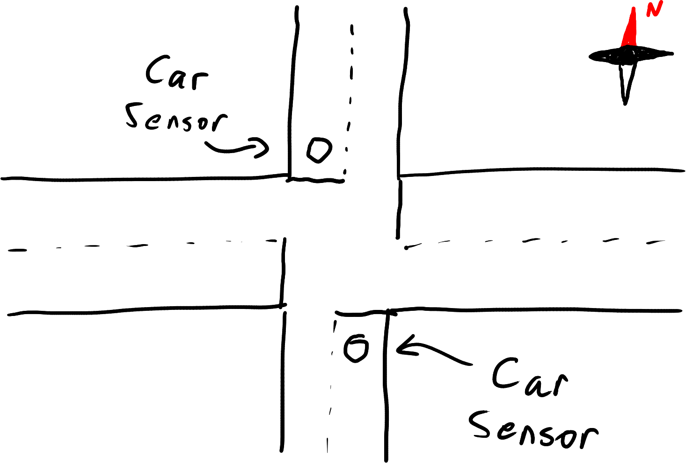
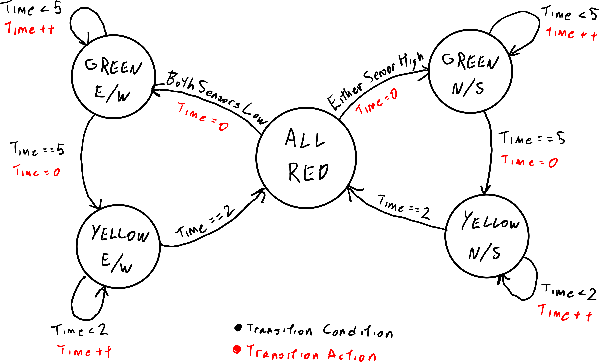

# Project 2: Traffic Light State Machine

In this project, you'll be creating software to control the traffic lights for a road intersection. State machines are
actually super useful for traffic lights! Instead of having to manage all of the possible conditions that might control
when any given light is lit up, the entire intersection can be governed by a small number of legal light states and
transitions between them. This makes it easy to verify safety specifications. If none of the states turn on
perpendicular green lights, we can be confident that the light controller won't cause a crash by showing green lights
to every direction.

For this project, we'll be modelling a four-way intersection between a large road (running east-west) and a smaller road
running north-south). Because the smaller road see much less traffic than the larger road, sensors have been installed
under the stop lines for the smaller road. Each sensor reads high (1) when a car is waiting at that spot, and low (0)
if no car is waiting at that spot. This lets the light controller make informed decisions about which road to
allow through on every cycle, prioritizing the larger road when no cars are waiting at the smaller road.



Our intersection will use fixed-length cycles, so the controller doesn't need to worry about responding immediately to
sensor inputs. Each light state will last for a certain duration, and the controller will only need to check the sensors
to decide which direction to turn green. There are no turns allowed at this intersection, so we don't need to worry
about turn signals.

## Program Behavior

Here is a summary of our desired light behavior:

* All lights should be red for one second between cycles.
* All yellow lights should stay lit for 2 seconds
* All green lights should stay lit for 5 seconds
* Green lights should only be turned on if their direction was just red
* Yellow lights should only be turned on if their direction was just green
* Red lights should only be turned on if their direction was just yellow

Each second of simulated time is indicated by a new line of input sent to the program's standard input. Each line of
input contains two binary digits. The first digit is the reading from the north sensor, and the second digit is the
reading from the south sensor.

Your program should respond to each line of input with a line of output describing which lights your controller would
like to turn on. This output should be six binary digits. These digits should encode the light outputs as follows

1. Red lights for north-south road
2. Yellow lights for north-south road
3. Green lights for north-south road
4. Red lights for east-west road
5. Yellow lights for east-west road
6. Green lights for east-west road

In this encoding scheme, red in all directions is "100100". Green for east-west is "100001", and green for north-south
is "001100".

A full cycle that allows the east-west road to travel would look like this:

100100 // Start cycle with all red lights
100001 // Green lights for east-west
100001
100001
100001
100001  // Green lights have now been on for 5 seconds
100010  // Yellow lights for east-west
100010  // Yellow lights have now been on for 2 seconds
100100  // Back to red to complete the cycle

When the controller is ready to turn on green lights to start a cycle, it must check the car sensors. If either sensor
is reading high (1), the controller should turn on the green lights for the north-south road. If both sensors are low
(0), the controller should turn on the green lights for the east-west road.

## State Machine Design

Before you start writing any code, design the state machine that your controller program will be implementing. Think
about what states your controller needs to have. What transitions need to exist between these states? How can you keep
track of time in this state machine?

We've included two hints for this project below. The first is the list of states we're using in our solution. The
second is our complete state machine design. Make sure you take time to try to work through this part
yourself if you can. These are here to help you along if you really, truly get stuck.

<details>
<summary>List of States</summary>

- All Red (Both directions have red lights)
- Green E/W (E/W road has green lights, N/S has red lights)
- Yellow E/W (E/W road has yellow lights, N/S has red lights)
- Green N/S (N/S road has green lights, E/W has red lights)
- Yellow N/S (N/S road has yellow lights, E/W has red lights)

</details>

<details>
<summary>Full State Machine</summary>



</details>

## Code Setup

You have been given a small bit of starter code to help you get going on this project. This starter code simply takes
input from `std::cin` one line at a time. When it finds a line whose length is not 2, the program ends. Take a moment
to read and understand this starter code. Remember, you can always check cppreference.com for any standard library
features you're not familiar with (ie. [std::getline()](https://en.cppreference.com/w/cpp/string/basic_string/getline)).

Included in the starter code are two structures `LightInputs` and `LightOutputs`. We'd like to encourage you to parse
the inputs from the `input` variable into an instance of `LightInputs`. It's a good idea to keep code organized, and
separating your input/output code from your state machine code should help keep each part simple.

While there are many ways to capture state machine-like behavior in a C++ program, we want you to practice the tools
you've been learning this week. We suggest making a class for your state machine.

Your class should probably have a constructor for initialization, some way of accepting sensor/time inputs, and some way
of returning light outputs. The inputs and outputs can be handled in one function
(ie. `LightOutputs Controller::update(LightInputs input)`) or split into different functions (ie.
`void Controller::putInput(LightInputs input)` and `LightOutputs Controller::getOutput()`).

You may want to add private functions to your class to split the work it has to do into meaningful sections.

Be sure to think about what data your class will need to keep track of. It's hopefully clear that you'll need to keep
track of the controller's current state. What other information does your controller need to keep track of? Make sure
it's all captured as private member variables of your class.

## Testing Your Code

A selection of test cases have been provided in the `test_cases` folder for this project along with a script,
`runner.sh`. When you build your code, this script and test cases directory will be copied to your build folder. Within
that folder, you can use the runner script to test your controller program against a specific test case. For example, to
run the first test case:

```shell script
$ ./runner.sh test_cases/test_case_1.txt
```

The runner script will show the output of your program at each time step, highlight any errors, and print a final
message telling you whether or not that run succeeded.

Once you've got your program passing all of these test cases, take a look at the reflection questions in the next
section.

## Reflection Questions

Congrats on completing your second training project! The following questions are to help guide you through digesting
the work you've done on this project and the things you've learned. These are questions you can think through on your
own or discuss with your teammates.

Our controller always allows cars going north or south to proceed if they are waiting. If our expectation that traffic
going north-south is uncommon turns out to be incorrect, what problem might this behavior cause? How would you change
the state machine for the controller to address this problem?

Do you feel that structuring this code using a class helped you understand the code better? Why or why not?

Did you use access specifiers (public, private, etc.) to protect your class's internal data? If not, how do you make
sure that your state variable only changes in accordance with your transition rules? Would you be certain of that
guarantee if you handed your class over to someone else to use (and potentially abuse)?
