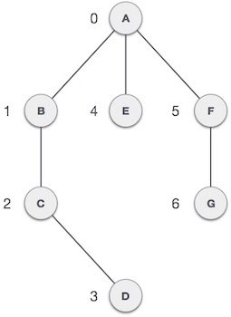
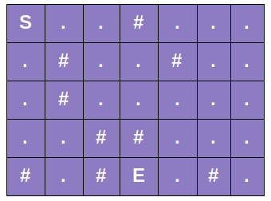
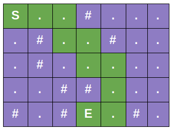
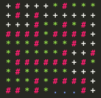

# Project 3
Welcome to project 3! In this week's project we will be going into graph search algorithms (breadth-first and depth-first search). These algoritms are an important graph search algorithm that can be used to solve many problems including finding the shortest path in a graph and solving puzzle games (such as Rubik's Cubes). Many problems in computer science can be thought of in terms of graphs. For example, analyzing networks, mapping routes, and scheduling are graph problems.

# Introduction To Graph Search Algorithms (Optional Read)
## Graph Data Structure
Graphs are mathematical structures that represent pairwise relationships between objects. A graph is a flow structure that represents the relationship between various objects. Before we proceed further, let's familiarize ourselves with some important terms:
- Vertex/Node − Each node of the graph is represented as a vertex. In the following example, the labeled circle represents vertices. Thus, A to G are vertices. We can represent them using an array as shown in the following image. Here A can be identified by index 0. B can be identified using index 1 and so on.
- Edge − Edge represents a path between two vertices or a line between two vertices. In the following example, the lines from A to B, B to C, and so on represents edges. We can use a two-dimensional array to represent an array as shown in the following image. Here AB can be represented as 1 at row 0, column 1, BC as 1 at row 1, column 2 and so on, keeping other combinations as 0.
- Adjacency − Two node or vertices are adjacent if they are connected to each other through an edge. In the following example, B is adjacent to A, C is adjacent to B, and so on.
- Path − Path represents a sequence of edges between the two vertices. In the following example, ABCD represents a path from A to D.



## Breadth-First Search (BFS)
Breadth-first search (BFS) is an algorithm for traversing or searching tree or graph data structures. It starts at an initial node and explores all of the neighbor nodes at the present depth prior to moving on to the nodes at the next depth level. Below is an example that shows the order in which the nodes would be expanded into within BFS:


A standard BFS implementation puts each vertex of the graph into one of two categories: visited and not visited. The purpose of the algorithm is to mark each vertex as visited while avoiding cycles. The algorithm works as follows:
1. Start by putting any one of the graph's vertices at the back of a **queue**.
2. Take the front item of the queue and add it to the visited list.
3. Create a list of that vertex's adjacent nodes. Add the ones which aren't in the visited list to the back of the queue.
4. Keep repeating steps 2 and 3 until the queue is empty.
Pseudo Code:
```
  procedure BFS(G, root) is
      let Q be a queue
      label root as discovered
      Q.enqueue(root)
      while Q is not empty do
          v := Q.dequeue()
          if v is the goal then
              return v
          for all edges from v to w in G.adjacentEdges(v) do
             if w is not labeled as discovered then
                 label w as discovered
                 w.parent := v
                 Q.enqueue(w)
```

## Depth-First Search (DFS)
Depth-first search (DFS) also is an algorithm for traversing or searching tree or graph data structures. The algorithm starts at an initial node and explores as far as possible along each branch before backtracking. Below is an example that shows the order in which the nodes would be expanded into within DFS:


A standard DFS implementation puts each vertex of the graph into one of two categories: visited and not visited. The purpose of the algorithm is to mark each vertex as visited while avoiding cycles. The DFS (iterative) algorithm works as follows:
1. Start by putting any one of the graph's vertices on top of a **stack**.
2. Take the top item of the stack and add it to the visited list.
3. Create a list of that vertex's adjacent nodes. Add the ones which aren't in the visited list to the top of the stack.
4. Keep repeating steps 2 and 3 until the stack is empty.
Pseudo Code:
```
procedure DFS(G, v) is
    let S be a stack
    S.push(v)
    while S is not empty do
        v = S.pop()
        if v is not labeled as discovered then
            label v as discovered
            for all edges from v to w in G.adjacentEdges(v) do
                S.push(w)
```

## BFS vs. DFS
BFS
  - BFS starts traversal from the root node and visits nodes in a level by level manner (i.e., visiting the ones closest to the root first).
  - Usually implemented using a queue data structure.
  - Optimal for finding the shortest distance.

DFS
  - DFS starts the traversal from the root node and visits nodes as far as possible from the root node (i.e., depth wise).
  - Usually implemented using a stack data structure.
  - Not optimal for finding the shortest distance.

# Problem
Suppose you are trapped in a 2D dungeon and you have to find the easiest way out. Hold on, we have some obstacles too. The dungeon is composed of unit cubes which may or may not be filled with rocks. It would take exactly one minute to move either east, west, south or north. You can’t move diagonally as the maze is tightly packed with solid rocks.



The dungeon has a size of R x C where R is number of rows and c is number of columns. We have to start at cell ‘S’ and we have an exit at cell ‘E’. The number (#) symbol depicts the roadblocks in the route and period (.) shows an open route.



In the given setup, one solution could be drawn as above in the green route. It is going to be your goal to find a path to the exit so you can escape the dungeon.

## Code Setup
You have been given a decent amount bit of starter code to help you get going on this project.
- dungeon.cpp [ DO NOT EDIT ]: Loads dungeon map and prints path
- graph_search.cpp [ EDIT ]: Where you will write your BFS & DFS implementation
- test_cases/* [ DO NOT EDIT ]: Some dungeon testcases we provide, you can just copy/paste it into terminal when it asks to input dungeon map

## Test Your Code
A selection of test cases have been provided in the `test_cases` folder for this project.
Example of running your code:
```$ ./dungeon BFS True ```
Then simply copy/paste one of test_cases text into the terminal and watch it run!

**Note:** When you mark a node as visited, make sure to set the corresponding grid cell to "*" so you can debug as you go. Also once you reach the exit node, iterate through the path nodes and set the corresponding grid cell to "+" for debugging.


